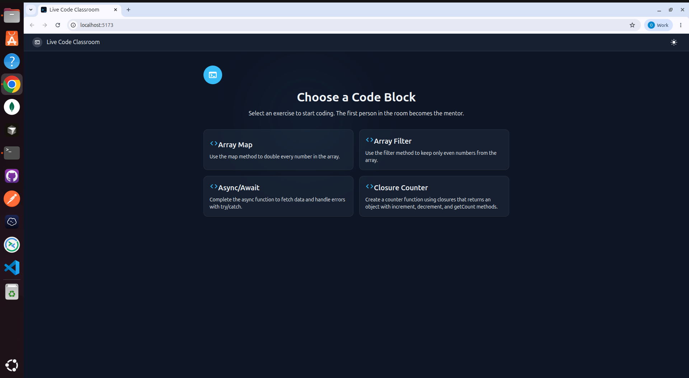
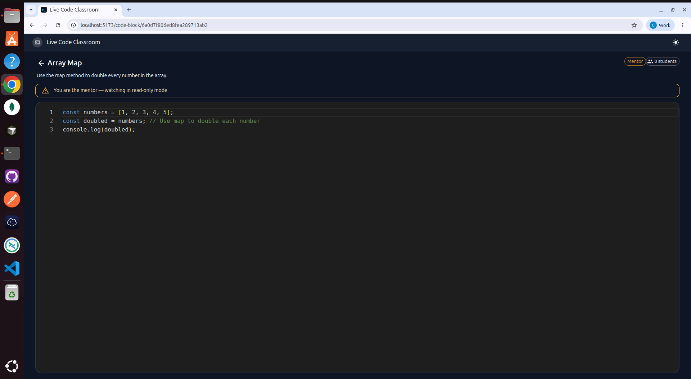
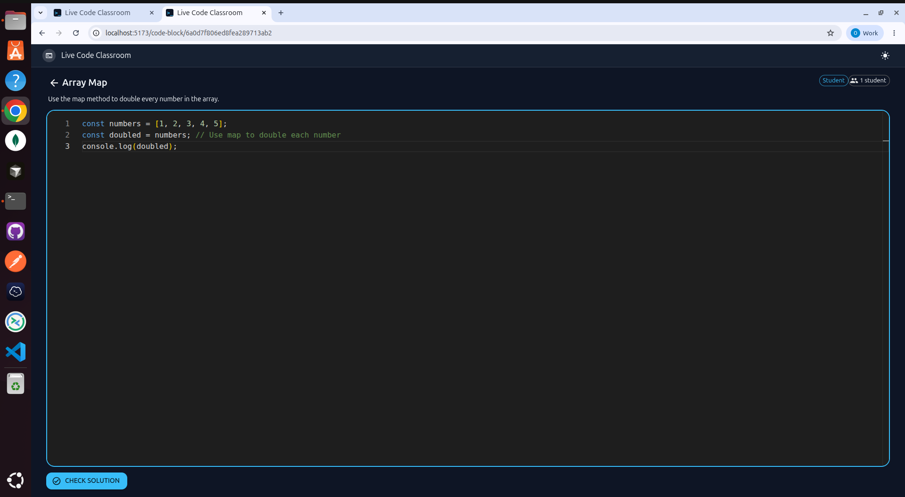
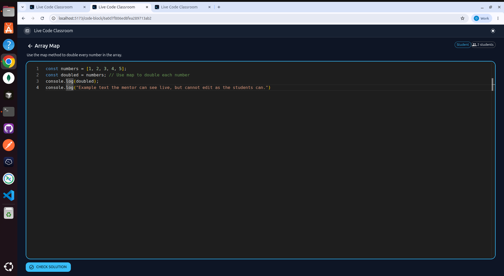
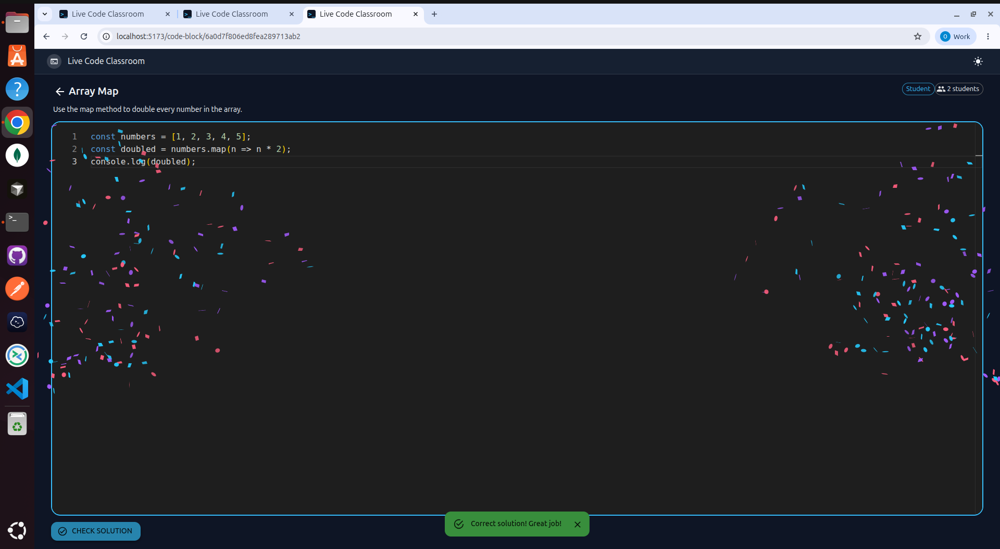

# Live Code Classroom

A real-time coding classroom where mentors observe students solving JavaScript exercises. Built with React, Express, MongoDB, Socket.IO, and Monaco Editor.



<details>
<summary>More screenshots</summary>

### Mentor View


### Student View


### Live Code Sync


### Correct Solution


</details>

## How It Works

1. A mentor creates a session by opening a code block
2. Students join the same code block and write their solution
3. The mentor sees every keystroke in real-time (read-only view)
4. Students can check their solution against the expected answer
5. When the mentor leaves, students are notified and redirected

**Role assignment:** The first person to open a code block becomes the mentor. Everyone else joins as a student.

## Tech Stack

| Layer | Technology |
|-------|-----------|
| Frontend | React 19, TypeScript, Vite, MUI |
| Code Editor | Monaco Editor (VS Code engine) |
| Backend | Express, Node.js |
| Database | MongoDB + Mongoose |
| Real-time | Socket.IO |
| Dev Environment | Docker Compose |

## Quick Start

### With Docker Compose
```bash
docker compose up
```
Then visit http://localhost:5173

### Manual Setup
```bash
# Backend
cd backend
cp .env.example .env
npm install
npm run seed   # populate code blocks
npm run dev

# Frontend (new terminal)
cd frontend
cp .env.example .env
npm install
npm run dev
```

## Design Notes & Limitations

Deliberate trade-offs, sized for this project's scope:

- **Broadcasts exclude the sender** — echoing a student's own keystrokes back arrives after newer local input and causes cursor jumps in the controlled editor, so `code-update` uses `socket.to(room)` rather than `io.to(room)`.
- **Roles are enforced server-side** — the mentor's read-only mode is a server rule (mentor `code-update` events are ignored), not just a disabled editor in the UI.
- **Room creation is race-safe** — the room entry and role assignment happen synchronously before any `await`, so two simultaneous joiners can't both become mentor.
- **Rooms live in memory** — sessions are scoped to a single server instance and cleared on restart. Multi-instance scaling would need a shared store (Redis adapter) and sticky sessions.
- **Sync is last-write-wins on the whole document** — no OT/CRDT. With one active student per room (the intended use), conflicts don't arise; concurrent editors would overwrite each other.

## API Endpoints

| Method | Path | Description |
|--------|------|-------------|
| `GET` | `/api/health` | Health check |
| `GET` | `/api/codeblocks` | List all code blocks |
| `GET` | `/api/codeblocks/:id` | Get a single code block |
| `POST` | `/api/codeblocks/:id/check` | Check solution (body: `{ code }`) |

### Socket.IO Events

| Event | Direction | Description |
|-------|-----------|-------------|
| `join-room` | Client → Server | Join a code block room |
| `assign-role` | Server → Client | Receive `"mentor"` or `"student"` role |
| `code-update` | Bidirectional | Send/receive live code changes |
| `students-count` | Server → Client | Current number of students in the room |
| `mentor-left` | Server → Client | Mentor disconnected, room closing |

## Environment Variables

### Backend (`backend/.env`)
| Variable | Description | Default |
|----------|-------------|---------|
| `PORT` | Server port | `3001` |
| `MONGO_URI` | MongoDB connection string | `mongodb://localhost:27017/live-code-classroom` |
| `ORIGIN` | Allowed CORS origin | `http://localhost:5173` |

### Frontend (`frontend/.env`)
| Variable | Description | Default |
|----------|-------------|---------|
| `VITE_SERVER_URL` | Backend URL | `http://localhost:3001` |

## Project Structure

```
├── backend/
│   ├── src/
│   │   ├── config.js              # Centralized env config
│   │   ├── server.js              # HTTP + Socket.IO server
│   │   ├── app.js                 # Express app, routes, middleware
│   │   ├── models/                # Mongoose models
│   │   ├── controllers/           # Route handlers
│   │   ├── routes/                # Express routes
│   │   ├── services/              # Socket.IO room logic
│   │   ├── socket/                # Socket.IO connection handler
│   │   └── middleware/            # Error handler
│   └── scripts/seed.js            # Database seed script
├── frontend/
│   └── src/
│       ├── pages/                 # LobbyPage, CodeRoomPage
│       ├── components/ui/         # CodeEditor (Monaco wrapper)
│       ├── components/layout/     # AppShell
│       ├── services/              # API calls
│       ├── contexts/              # ThemeContext
│       ├── types/                 # TypeScript interfaces
│       └── routes/                # Route definitions
└── docker-compose.yml
```
